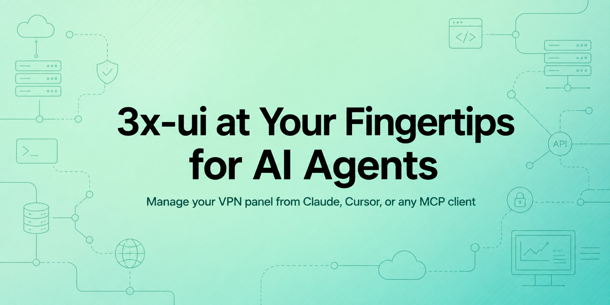

<p align="center">
  
</p>

<p align="center">
  <a href="https://www.npmjs.com/package/3xui-mcp"></a>
  <a href="https://www.npmjs.com/package/3xui-mcp"></a>
  <a href="./LICENSE"></a>
  
  <a href="https://github.com/iamhelitha/3xui-mcp/stargazers"></a>
</p>

# 3xui-mcp

MCP (Model Context Protocol) server for the [3x-ui](https://github.com/MHSanaei/3x-ui) panel, built on [`3xui-api-client`](https://www.npmjs.com/package/3xui-api-client). Manage inbounds and clients on your VPN panel directly from Claude, Cursor, or any MCP-compatible client.

Scoped intentionally to keep tool context small: **read operations** plus **full CRUD for inbounds and clients**. Nodes, groups, geo files, backups, Xray config, and panel settings are out of scope — extend `src/tools/` if you need them.

## Tools

| Tool | Type | Description |
|---|---|---|
| `list_inbounds` | read | List all inbounds |
| `get_inbound` | read | Get one inbound by ID |
| `create_inbound` | write | Create an inbound |
| `update_inbound` | write | Replace an inbound's config |
| `delete_inbound` | write | Delete an inbound |
| `list_clients` | read | List all clients across inbounds |
| `get_client` | read | Get one client by email |
| `get_client_traffic` | read | Get a client's traffic usage |
| `list_online_clients` | read | List currently connected clients |
| `create_client` | write | Add a client with auto-generated credentials |
| `update_client` | write | Update a client's limits/expiry/state |
| `delete_client` | write | Delete a client by email |

## Configuration

Set credentials via environment variables — pick **one** auth mode:

```bash
# Required
THREEXUI_BASE_URL=https://your-panel.example.com

# Cookie auth (admin username/password)
THREEXUI_USERNAME=admin
THREEXUI_PASSWORD=your-password

# OR API token auth (skips username/password)
THREEXUI_API_TOKEN=your-token

# Optional, default "auto"
THREEXUI_PANEL_TYPE=auto   # auto | modern | legacy
```

## Use with an MCP client

Add to your client's MCP config (e.g. Claude Desktop `claude_desktop_config.json`). No install or path needed — `npx` fetches and runs the published package on demand:

```json
{
  "mcpServers": {
    "3xui": {
      "command": "npx",
      "args": ["-y", "3xui-mcp"],
      "env": {
        "THREEXUI_BASE_URL": "https://your-panel.example.com",
        "THREEXUI_USERNAME": "admin",
        "THREEXUI_PASSWORD": "your-password"
      }
    }
  }
}
```

### Running from source instead

If you're developing this server locally rather than using the published package:

```bash
npm install
npm run build
```

Then point your MCP config at the built file directly — replace the path below with wherever you actually cloned this repo:

```json
{
  "mcpServers": {
    "3xui": {
      "command": "node",
      "args": ["/absolute/path/to/3xui-mcp/dist/index.js"],
      "env": {
        "THREEXUI_BASE_URL": "https://your-panel.example.com",
        "THREEXUI_USERNAME": "admin",
        "THREEXUI_PASSWORD": "your-password"
      }
    }
  }
}
```

## Test locally

```bash
npm run inspector
```

Opens the [MCP Inspector](https://github.com/modelcontextprotocol/inspector) against this server.

## Agent skill

[`skills/3xui-mcp/SKILL.md`](skills/3xui-mcp/SKILL.md) documents every tool's required/optional fields, units (GB vs bytes, ms timestamps), and common workflows for an AI agent driving this server — load it alongside the server so the agent doesn't have to guess input shapes from tool descriptions alone.
